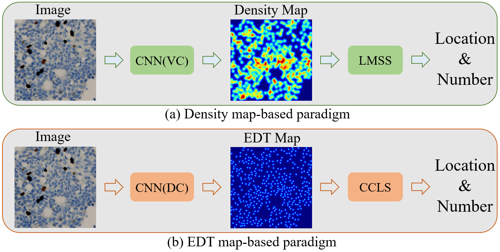

# Cell Localization and Counting

This repository includes three papers about cell:
1) Exponential Distance Transform Maps for Cell Localization; [Paper](https://www.sciencedirect.com/science/article/pii/S0952197623018183#fig2)
2) Multi-scale Hypergraph-based Feature Alignment Network for Cell Localization;  [Paper](https://www.sciencedirect.com/science/article/pii/S0031320324000116)
3) Lite-UNet: A lightweight and efficient network for cell localization. [Paper](https://www.sciencedirect.com/science/article/pii/S0952197623018183#fig2)


## Overview


# Visualizations
Compared with density map


# Environment

	python >=3.6 
	pytorch >=1.4
	opencv-python >=4.0
	scipy >=1.4.0
	h5py >=2.10
	pillow >=7.0.0
	imageio >=1.18
	nni >=2.0 (python3 -m pip install --upgrade nni)


# Datasets

- Download all dataset from [Google-Drive](https://drive.google.com/drive/folders/1jlt9UtApF1GM28PjVwA933kfgbNSZD01?usp=drive_link)


# Generate EDT Ground-Truth

```
cd data
python CoNIC_process.py
```
Generate all datasets by this way.


# Quickly test

```
git clone https://github.com/dk-liang/FIDTM.git
```
Download Dataset and Model  
Generate FIDT map ground-truth  

```
Generate image file list: python make_npydata.py
```

**Test example:**

```
python test.py --dataset ShanghaiA --pre ./model/ShanghaiA/model_best.pth --gpu_id 0

```
**If you want to generate bounding boxes,**

```
python test.py --test_dataset ShanghaiA --pre model_best.pth  --visual True
(remember to change the dataset path in test.py)  
```


**Evaluation example:**  

For Shanghai tech,  JHU-Crowd (test set), and NWPU-Crowd (val set):

```
cd ./local_eval
python eval.py ShanghaiA  
python eval.py ShanghaiB
python eval.py JHU  
python eval.py NWPU
```
For UCF-QNRF dataset:
```
python eval_qnrf.py --data_path path/to/UCF-QNRF_ECCV18 
```
For NWPU-Crowd (test set), please submit the nwpu_pred_fidt.txt to the [website](https://www.crowdbenchmark.com/nwpucrowdloc.html).

We also provide the predicted coordinates txt file in './local_eval/point_files/', and you can use them to fairly evaluate the other localization metric.   

 (We hope the community can provide the predicted coordinates file to help other researchers fairly evaluate the localization performance.)

**Tips**:  
The GT format is:

```
1 total_count x1 y1 4 8 x2 y2 4 8 ..... 
2 total_count x1 y1 4 8 x2 y2 4 8 .....
```
The predicted format is:
```
1 total_count x1 y1 x2 y2.....
2 total_count x1 y1 x2 y2.....
```
The evaluation code is modifed from [NWPU](https://github.com/gjy3035/NWPU-Crowd-Sample-Code-for-Localization).


# Training

The training strategy is very simple. You can replace the density map with the FIDT map in any regressors for training. 

If you want to train based on the HRNET (borrow from the IIM-code [link](https://github.com/taohan10200/IIM/tree/main/model/HR_Net)), please first download the ImageNet pre-trained models from the official [link](https://onedrive.live.com/?authkey=!AKvqI6pBZlifgJk&cid=F7FD0B7F26543CEB&id=F7FD0B7F26543CEB!116&parId=F7FD0B7F26543CEB!105&action=locate), and replace the pre-trained model path in HRNET/congfig.py (__C.PRE_HR_WEIGHTS). 

Here, we provide the training baseline code, and the I-SSIM loss will be released when the review is completed. 

**Training baseline example:**

```
python train_baseline.py --dataset ShanghaiA --crop_size 256 --save_path ./save_file/ShanghaiA 
python train_baseline.py --dataset ShanghaiB --crop_size 256 --save_path ./save_file/ShanghaiB  
python train_baseline.py --dataset UCF_QNRF --crop_size 512 --save_path ./save_file/QNRF
python train_baseline.py --dataset JHU --crop_size 512 --save_path ./save_file/JHU
```
For ShanghaiTech, you can train by a GPU with 8G memory. For other datasets, please utilize a single GPU with 24G memory or multiple GPU for training. We have reorganized the code, which is usually better than the results of the original [manuscript](https://arxiv.org/abs/2102.07925).

**Improvements**
We have not studied the effect of some hyper-parameter. Thus, the results can be further improved by using some tricks, such as adjust the learning rate, batch size, crop size, and data augmentation. 

# Reference
If you find this project is useful for your research, please cite:
```
@article{liang2022focal,
  title={Focal inverse distance transform maps for crowd localization},
  author={Liang, Dingkang and Xu, Wei and Zhu, Yingying and Zhou, Yu},
  journal={IEEE Transactions on Multimedia},
  year={2022},
  publisher={IEEE}
}

@article{li2024multi,
  title={Multi-scale hypergraph-based feature alignment network for cell localization},
  author={Li, Bo and Yong, Zhang and Zhang, Chengyang and Piao, Xinglin and Hu, Yongli and Yin, Baocai},
  journal={Pattern Recognition},
  pages={110260},
  year={2024},
  publisher={Elsevier}
}

```


